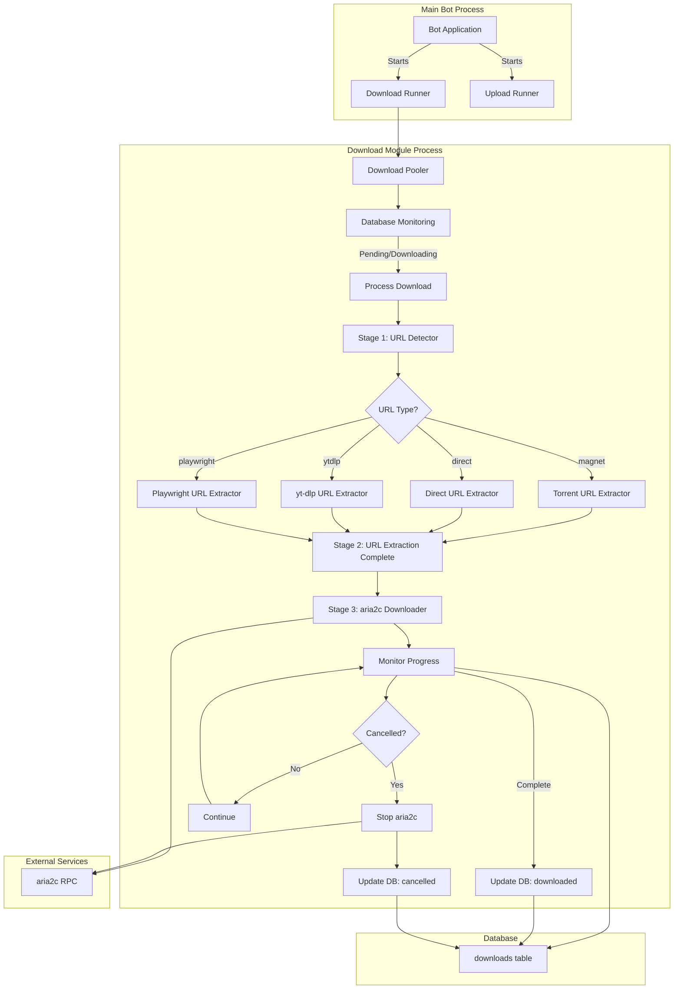
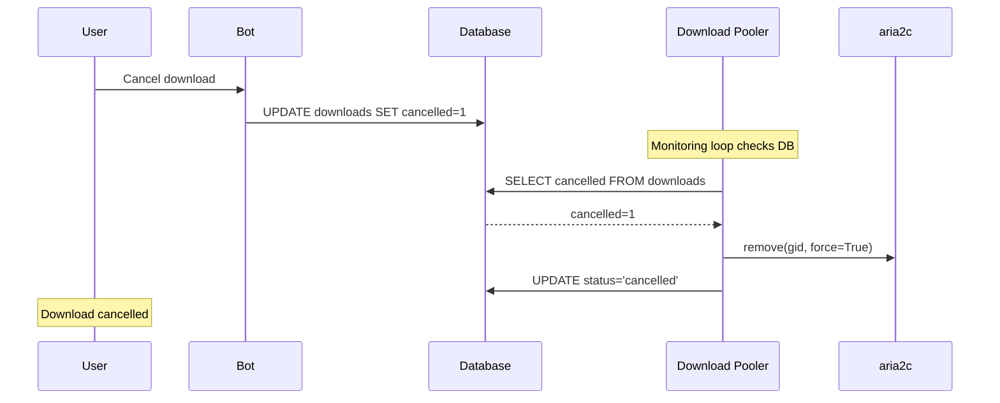

# Independent Download Module - Architecture Plan (Revised)

## Unresolved Questions
None

## Current Understanding

Based on your requirements, download module should:
- Run as a **separate process** for isolation and reliability
- Handle **downloads only** (upload handled separately by upload_module)
- Use **3-stage download process**: URL Detection → URL Extraction → Download
- Use **aria2c** as external downloader for all downloads
- Update database with **progress, speed, ETA** during download
- Support **cancel** with `cancelled` flag (no pause/resume)
- Use **direct database monitoring** (check multiple columns for state changes)
- **Auto-start with bot** but also support **manual control**
- Process **one download at a time** (sequential)
- All download-related code in **separate module directory**

## Architecture Overview



## 3-Stage Download Process

### Stage 1: URL Detection
**Purpose:** Determine download method for a URL

**Component:** `url_detector.py`

**Responsibilities:**
- Classify URL as: `torrent`, `direct`, `ytdlp`, `playwright`, `unknown`
- Fast detection without full extraction

**Output:** URL type string

### Stage 2: URL Extraction
**Purpose:** Extract actual download URL, headers, and cookies

**Components:**
- `extractors/torrent_extractor.py` - Extract torrent info (magnet → torrent file)
- `extractors/ytdlp_extractor.py` - Extract direct URL from yt-dlp
- `extractors/playwright_extractor.py` - Extract video URL via Playwright
- `extractors/direct_extractor.py` - Validate direct file URLs

**Responsibilities:**
- Extract actual download URL
- Extract HTTP headers (cookies, auth)
- Extract metadata (title, file size)

**Output:** Dictionary with `url`, `headers`, `cookies`, `title`, `file_size`

### Stage 3: Download via aria2c
**Purpose:** Download file using aria2c RPC with progress tracking

**Component:** `aria2c_downloader.py`

**Responsibilities:**
- Add download to aria2c via RPC
- Monitor download progress (speed, ETA, percentage)
- Update database with progress every 5 seconds
- Check `cancelled` flag periodically
- Stop aria2c download if cancelled
- Handle download completion and errors

**Output:** File path to downloaded file

## File Structure

```
src/
├── pooler/                              # Process runners (separate from modules)
│   ├── __init__.py
│   ├── download_runner.py                  # NEW: Download process manager
│   └── upload_runner.py                  # NEW: Upload process manager
│
├── download_module/                      # All download-related code
│   ├── __init__.py
│   ├── download_pooler.py               # Main orchestrator (enhanced)
│   ├── retry_handler.py                 # Existing
│   │
│   ├── url_detector.py                  # Stage 1: URL type detection
│   │
│   ├── extractors/                     # Stage 2: URL extractors
│   │   ├── __init__.py
│   │   ├── base_extractor.py           # Base class for extractors
│   │   ├── torrent_extractor.py         # Magnet/torrent URLs
│   │   ├── ytdlp_extractor.py         # yt-dlp supported sites
│   │   ├── playwright_extractor.py      # Playwright crawler
│   │   └── direct_extractor.py        # Direct file URLs
│   │
│   ├── aria2c_downloader.py           # Stage 3: aria2c downloader
│   │
│   └── utils/                        # Shared utilities
│       ├── __init__.py
│       └── cancel_manager.py           # Cancel logic
│
├── upload_module/                      # Existing upload module (unchanged)
│   ├── __init__.py
│   ├── upload_pooler.py
│   ├── upload_manager.py
│   └── uploader_bot.py
│
└── bot.py                             # ENHANCE: Use download_runner
```

## Component Details

### 1. URL Detector (`url_detector.py`)

```python
class URLDetector:
    """Stage 1: Detect URL type"""
    
    def detect(self, url: str) -> Dict:
        """
        Detect URL type and initial metadata.
        
        Returns:
            {
                'type': 'torrent' | 'direct' | 'ytdlp' | 'playwright' | 'unknown',
                'url': str
            }
        """
        # Detection logic...
        return {
            'type': detected_type,
            'url': url
        }
```

### 2. Extractors (`extractors/`)

**Base Extractor:**
```python
class BaseExtractor(ABC):
    """Base class for URL extractors"""
    
    @abstractmethod
    async def extract(self, url: str, download_id: int) -> Dict:
        """
        Extract download URL and metadata.
        
        Returns:
            {
                'download_url': str,      # Actual download URL
                'headers': Dict,         # HTTP headers
                'cookies': List,          # Cookies
                'title': str,            # File title
                'file_size': int         # File size in bytes
            }
        """
        pass
```

**Torrent Extractor:**
```python
class TorrentExtractor(BaseExtractor):
    """Extract torrent info for aria2c"""
    
    async def extract(self, url: str, download_id: int) -> Dict:
        # For magnet links, return magnet URL directly
        # aria2c handles magnet downloads
        return {
            'download_url': url,  # magnet link
            'headers': {},
            'cookies': [],
            'title': 'Torrent',
            'file_size': None
        }
```

**yt-dlp Extractor:**
```python
class YtdlpExtractor(BaseExtractor):
    """Extract direct URL using yt-dlp"""
    
    async def extract(self, url: str, download_id: int) -> Dict:
        # Use yt-dlp to extract direct URL, headers, cookies
        info = await self._extract_ytdlp_info(url)
        return {
            'download_url': info['url'],
            'headers': info['http_headers'],
            'cookies': info['cookies'],
            'title': info['title'],
            'file_size': info.get('filesize')
        }
```

**Playwright Extractor:**
```python
class PlaywrightExtractor(BaseExtractor):
    """Extract video URL using Playwright crawler"""
    
    async def extract(self, url: str, download_id: int) -> Dict:
        # Use Playwright to find video URL
        video_info = await self._crawl_page(url, download_id)
        return {
            'download_url': video_info['url'],
            'headers': {},
            'cookies': [],
            'title': video_info['title'],
            'file_size': video_info.get('filesize')
        }
```

**Direct Extractor:**
```python
class DirectExtractor(BaseExtractor):
    """Validate direct file URLs"""
    
    async def extract(self, url: str, download_id: int) -> Dict:
        # Validate URL, get file info via HEAD request
        file_info = await self._get_file_info(url)
        return {
            'download_url': url,
            'headers': {},
            'cookies': [],
            'title': file_info['filename'],
            'file_size': file_info['filesize']
        }
```

### 3. aria2c Downloader (`aria2c_downloader.py`)

```python
class Aria2cDownloader:
    """Stage 3: Download via aria2c RPC with cancel support"""
    
    def __init__(self, db, rpc_url: str, download_dir: str):
        self.db = db
        self.rpc_url = rpc_url
        self.download_dir = download_dir
        self.aria = self._init_aria2c()
        self.current_gid = None
    
    async def download(self, url: str, filename: str, download_id: int,
                    headers: Dict = None, cookies: List = None) -> str:
        """
        Download file via aria2c.
        
        Returns:
            Path to downloaded file
        """
        # Add to aria2c
        gid = await self._add_to_aria2c(url, filename, headers, cookies)
        self.current_gid = gid
        
        # Monitor download
        return await self._monitor_download(gid, download_id)
    
    async def _monitor_download(self, gid: str, download_id: int) -> str:
        """Monitor download with cancel support"""
        
        while True:
            # Check cancel status
            if await self._is_cancelled(download_id):
                await self._stop_download(gid)
                self.db.update_download_status(download_id, 'cancelled')
                raise Exception("Download cancelled by user")
            
            # Get aria2c status
            download = self.aria.get_download(gid)
            
            # Update progress in database
            progress = self._calculate_progress(download)
            speed = download.download_speed
            eta = download.eta.total_seconds() if download.eta else 0
            
            self.db.update_progress(
                download_id,
                progress=progress,
                download_speed=speed / (1024 * 1024),
                eta_seconds=int(eta)
            )
            
            # Check completion
            if download.status == 'complete':
                return self._get_file_path(download)
            
            if download.status == 'error':
                raise Exception(download.error_message)
            
            await asyncio.sleep(2)
    
    async def _stop_download(self, gid: str):
        """Stop aria2c download"""
        self.aria.remove([gid], force=True)
    
    async def _is_cancelled(self, download_id: int) -> bool:
        """Check if download is cancelled in database"""
        download = self.db.get_download(download_id)
        return download.get('cancelled', False)
```

### 4. Download Pooler (Enhanced)

```python
class DownloadPooler:
    """Main download orchestrator with 3-stage process"""
    
    async def _process_download(self, download: Dict):
        """Process download with 3-stage pipeline"""
        download_id = download['id']
        url = download['url']
        
        # Stage 1: URL Detection
        detection = self.url_detector.detect(url)
        logger.info(f"URL type: {detection['type']}")
        
        # Stage 2: URL Extraction
        extractor = self._get_extractor(detection['type'])
        extracted = await extractor.extract(url, download_id)
        
        # Update metadata
        self.db._update_download_metadata(
            download_id,
            title=extracted['title'],
            file_size=extracted['file_size']
        )
        
        # Stage 3: Download via aria2c
        self.db.update_download_status(download_id, 'downloading')
        
        filename = self._sanitize_filename(extracted['title'])
        file_path = await self.aria2c_downloader.download(
            url=extracted['download_url'],
            filename=filename,
            download_id=download_id,
            headers=extracted.get('headers'),
            cookies=extracted.get('cookies')
        )
        
        # Complete
        self.db.update_download_status(download_id, 'downloaded')
        self.db._update_file_path(download_id, file_path)
        
        return file_path
```

### 5. Cancel Manager (`utils/cancel_manager.py`)

```python
class CancelManager:
    """Handle cancel logic for downloads"""
    
    @staticmethod
    async def check_and_handle_cancel(download_id: int, db) -> bool:
        """
        Check if download should be cancelled and handle it.
        
        Returns:
            True if cancelled, False if should continue
        """
        download = db.get_download(download_id)
        
        if download.get('cancelled', False):
            logger.info(f"Download {download_id} cancelled")
            return True
        
        return False
    
    @staticmethod
    async def cancel_download(download_id: int, db):
        """Mark download as cancelled in database"""
        db.update_download_status(download_id, 'cancelled')
```

## Cancel Flow



## Database Monitoring

**Instead of simple polling for pending items, the download pooler will:**

1. **Check for new pending downloads** - Process next pending item
2. **Check for interrupted downloads** - Resume `downloading` items on startup
3. **Check for cancel requests** - Monitor `cancelled` flag during download
4. **Check for status changes** - React to database updates

**Monitoring Loop:**
```python
async def start(self, poll_interval: int = 1):
    """Main monitoring loop"""
    
    # Handle interrupted downloads on startup
    await self._handle_interrupted_downloads()
    
    while self.running:
        try:
            # Check for shutdown signal
            if self.shutdown_event.is_set():
                break
            
            # Check if currently downloading
            if self.current_download_id is None:
                # Get next pending
                download = await self._get_next_pending_download()
                if download:
                    asyncio.create_task(self._process_download(download))
            else:
                # Currently downloading - check cancel status
                # (handled in aria2c_downloader._monitor_download)
                pass
            
            await asyncio.sleep(poll_interval)
            
        except Exception as e:
            logger.error(f"Monitoring loop error: {e}")
            await asyncio.sleep(5)
```

## Database Updates

### New Column

```sql
-- Add cancelled column to downloads table
ALTER TABLE downloads ADD COLUMN cancelled BOOLEAN DEFAULT 0;
```

### New/Enhanced Methods

```python
# In database/manager.py

def update_download_metadata(self, download_id: int, title: str = None,
                         file_size: int = None):
    """Update download metadata."""
    with self.get_connection() as conn:
        cursor = conn.cursor()
        cursor.execute("""
            UPDATE downloads
            SET title = COALESCE(?, title),
                file_size = COALESCE(?, file_size)
            WHERE id = ?
        """, (title, file_size, download_id))
        conn.commit()

def update_file_path(self, download_id: int, file_path: str):
    """Update file path after download."""
    with self.get_connection() as conn:
        cursor = conn.cursor()
        cursor.execute("""
            UPDATE downloads
            SET file_path = ?
            WHERE id = ?
        """, (file_path, download_id))
        conn.commit()

def get_downloads_by_status(self, status: str) -> List[Dict]:
    """Get all downloads with specific status."""
    with self.get_connection() as conn:
        cursor = conn.cursor()
        cursor.execute("""
            SELECT * FROM downloads
            WHERE status = ?
            ORDER BY added_date ASC
        """, (status,))
        return [dict(row) for row in cursor.fetchall()]

def mark_cancelled(self, download_id: int):
    """Mark download as cancelled."""
    with self.get_connection() as conn:
        cursor = conn.cursor()
        cursor.execute("""
            UPDATE downloads
            SET cancelled = 1, status = 'cancelled'
            WHERE id = ?
        """, (download_id,))
        conn.commit()
```

## Implementation Phases

### Phase 1: File Structure Reorganization
- [ ] Create `src/pooler/` directory
- [ ] Create `src/download_module/extractors/` directory
- [ ] Create `src/download_module/utils/` directory
- [ ] Move/rename existing files to new structure

### Phase 2: URL Detection (Stage 1)
- [ ] Create `url_detector.py` in download_module
- [ ] Implement URL type detection

### Phase 3: URL Extractors (Stage 2)
- [ ] Create `base_extractor.py`
- [ ] Create `torrent_extractor.py`
- [ ] Create `ytdlp_extractor.py`
- [ ] Create `playwright_extractor.py`
- [ ] Create `direct_extractor.py`

### Phase 4: aria2c Downloader (Stage 3)
- [ ] Create `aria2c_downloader.py`
- [ ] Implement aria2c RPC integration
- [ ] Add progress monitoring
- [ ] Add cancel support

### Phase 5: Cancel Manager
- [ ] Create `cancel_manager.py`
- [ ] Implement cancel checking logic
- [ ] Implement cancel handling

### Phase 6: Enhance Download Pooler
- [ ] Update `download_pooler.py` with 3-stage pipeline
- [ ] Add interrupted download handling
- [ ] Add cancel status checking during download
- [ ] Integrate with extractors and aria2c_downloader

### Phase 7: Database Enhancements
- [ ] Add `cancelled` column to downloads table
- [ ] Add `update_download_metadata()` method
- [ ] Add `update_file_path()` method
- [ ] Add `get_downloads_by_status()` method
- [ ] Add `mark_cancelled()` method

### Phase 8: Download Runner
- [ ] Create `src/pooler/download_runner.py`
- [ ] Implement process lifecycle management
- [ ] Add signal handling

### Phase 9: Bot Integration
- [ ] Update `bot.py` to use `download_runner`
- [ ] Add cancel command
- [ ] Add download process status display

### Phase 10: Testing
- [ ] Test URL detection for all types
- [ ] Test URL extraction for all extractors
- [ ] Test aria2c download with progress tracking
- [ ] Test cancel functionality
- [ ] Test interrupted download recovery
- [ ] Test process start/stop

## Key Design Decisions

| Decision | Rationale |
|----------|-----------|
| 3-stage process | Clear separation of concerns, easier to test |
| aria2c for all downloads | Unified progress tracking, cancel support |
| No pause/resume | Simplified implementation, user can cancel and re-add |
| Separate module directory | Better code organization, easier maintenance |
| Database-only communication | No inter-process messaging complexity |
| Sequential processing | Simpler, predictable resource usage |
| Cancel support | User can stop unwanted downloads |

## Configuration

```bash
# Download Module
DOWNLOAD_POLL_INTERVAL=1          # Seconds between polls
DOWNLOAD_DIR=./downloads          # Download directory
ARIA2C_RPC_URL=http://localhost:6800/jsonrpc
MAX_DOWNLOAD_RETRIES=5
RETRY_BASE_DELAY=30              # Seconds
```

---

*This is the revised architecture plan with cancel support and simplified design (no pause/resume). Ready for implementation.*
